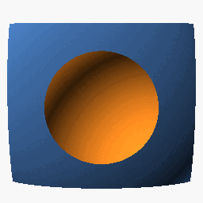

# Gallery

| Model | STL | SCAD |
|-------|-----|------|
|  | [`aluminum-base.stl`](aluminum-base.stl) | [`aluminum-base.scad`](aluminum-base.scad) |
|  | [`brass-base.stl`](brass-base.stl) | [`brass-base.scad`](brass-base.scad) |
|  | [`glass-base.stl`](glass-base.stl) | [`glass-base.scad`](glass-base.scad) |
|  | [`neodymium-base.stl`](neodymium-base.stl) | [`neodymium-base.scad`](neodymium-base.scad) |
|  | [`nylon-base.stl`](nylon-base.stl) | [`nylon-base.scad`](nylon-base.scad) |
|  | [`steel-base.stl`](steel-base.stl) | [`steel-base.scad`](steel-base.scad) |
|  | [`titanium-base.stl`](titanium-base.stl) | [`titanium-base.scad`](titanium-base.scad) |
|  | [`tungsten-base.stl`](tungsten-base.stl) | [`tungsten-base.scad`](tungsten-base.scad) |
|  | [`zirconia-base.stl`](zirconia-base.stl) | [`zirconia-base.scad`](zirconia-base.scad) |
